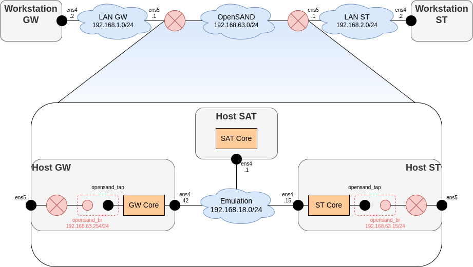

# Setup 

- vagrant up

- vagrant ssh <vm-name>



## Testing

To test the good behavior, with the example topology we chose, we can ping WS_ST from WS_GW:

```bash
ping 192.168.2.2
```

The ping should receive response, with a delay of around 500ms.

The ping must also pass between GW and ST directly, still with 500ms delay. For example on GW:

```bash
ping 192.168.63.15
```